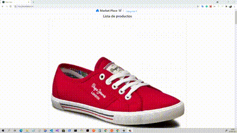

## Weblcash E-commerce Ejemplo

Para poder ejecutar la aplicación debes escribir en consola:

### `npm start`

Se ejecutará en modo Desarrollo en el puerto
[http://localhost:3000](http://localhost:3000).

